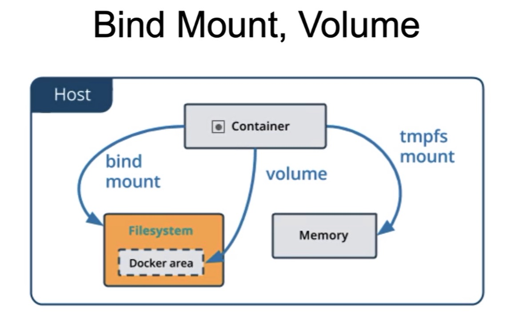

# docker - 数据管理

## 需求
- 永久存储数据
- 容器数据转移

## 解决方案
- Bind mounts挂载主机目录
- Volumes数据卷

## bind mount
本地文件夹和容器内的文件夹做一个同步的对应，可类似于**共享**
```
Dockerfile
COPY
WORKDIR
```
## volume
> 数据存在`docker area`里面

### 创建
```sh
docker volume create <volume_name>
docker volume ls
docker volume inspect <volume_name>
docker volume prune
```
### 启动一个挂载数据卷的容器

在用 `docker run` 命令的时候，使用 `--mount` 标记来将 数据卷 挂载到容器里。在一次 `docker run` 中可以挂载多个 数据卷。
下面创建一个名为 `web` 的容器，并加载一个 数据卷 到容器的 `/usr/share/nginx/html` 目录。
- -v
- --mount
```sh
$ docker run -d -P \
    --name web \
    # -v my-vol:/usr/share/nginx/html \
    --mount source=my-vol,target=/usr/share/nginx/html \
    nginx:alpine
```
### 查看数据卷的具体信息
```sh
docker inspect <volume>
```
**数据卷**是被设计用来**持久化数据**的，它的生命周期独立于容器，`Docker`不会在容器被删除后自动删除**数据卷**，并且也不存在垃圾回收这样的机制来处理没有任何容器引用的**数据卷**。如果需要在删除容器的同时移除数据卷。可以在删除容器的时候使用`docker rm -v`这个命令。
> docker卸载后清除容器?

## 挂载主机目录
### 挂载一个主机目录作为数据卷
使用`--mount`标记可以指定挂载一个本地主机的目录到容器中去。
```sh
$ docker run -d -P \
    --name web \
    # -v /src/webapp:/usr/share/nginx/html \
    --mount type=bind,source=/src/webapp,target=/usr/share/nginx/html \
    nginx:alpine
```
上面的命令加载主机的`/src/webapp`目录到容器的`/usr/share/nginx/html`目录。这个功能在进行测试的时候十分方便，比如用户可以放置一些程序到本地目录中，来查看容器是否正常工作。本地目录的路径必须是**绝对路径**，以前使用 `-v`参数时如果本地目录不存在`Docker`会自动为你创建一个文件夹，现在使用`--mount`参数时如果本地目录不存在，`Docker`会报错。

`Docker`挂载主机目录的默认权限是**读写**，用户也可以通过增加 `readonly`指定为**只读**。

